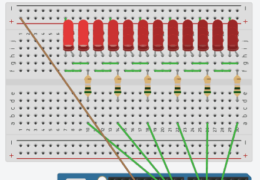

  
   
  <a href="https://www.tinkercad.com/things/h6UGRvyt57M?sharecode=AdzrjSHtaL6RfG9oV-UQ7uABUGXwvTwtX3bNIyHkgfQ">
    Live Demo on TinkerCad
  </a>

# Arduino Knight Rider

This is an Arduino project that creates a "Knight Rider" effect, also known as Larson Scanner. The Arduino Knight Rider is a circuit that features a series of LEDs that move back and forth in a "scanning" motion, creating a dynamic and eye-catching effect. The name Larson scanner is derived from Glen A. Larson, the creator of the original "Knight Rider" television show, which featured a car with a similar light sequence.
  
<!-- ABOUT THE PROJECT -->
## About The Project

The Arduino Knight Rider project uses an Arduino board to control the LEDs connected to the Larson scanner circuit. The code defines the pins that the LEDs are connected to and sets them to output mode. The writeToPins function takes a brightness value as input and writes that value to all of the LED pins. The setThreeLights function controls the brightness of three adjacent LEDs at a time, with the center LED being the brightest and the outer two LEDs being dimmer.

The loop function controls the sequence of the lights, with the setThreeLights function being called in a loop to move the scanning effect across the row of LEDs. The sequence then reverses direction and repeats, creating the classic "Knight Rider" effect. Connected to a potentiometer, the speed of the scanning effect can be adjusted.

## Built With

- <a href="https://www.arduino.cc/">
     Arduino
</a>

- <a href="https://www.tinkercad.com/">
     Tinkercad
</a>

## Getting Started
To replicate this project, you will need an Arduino board, a breadbord, and several LEDs. The code for the project is provided in the main.ino file. Simply upload this file to your Arduino board and connect the LEDs to the appropriate pins as defined in the code.

You can also see a live demo of the project on  <a href="https://www.tinkercad.com/things/h6UGRvyt57M?sharecode=AdzrjSHtaL6RfG9oV-UQ7uABUGXwvTwtX3bNIyHkgfQ">TinkerCad</a>.

## Contributing
This project is open to contributions and improvements. Feel free to fork the repository, make your changes, and submit a pull request.

## License
This project is licensed under the MIT License - see the LICENSE file for details.